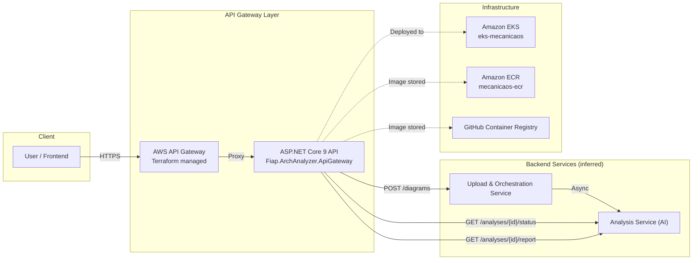
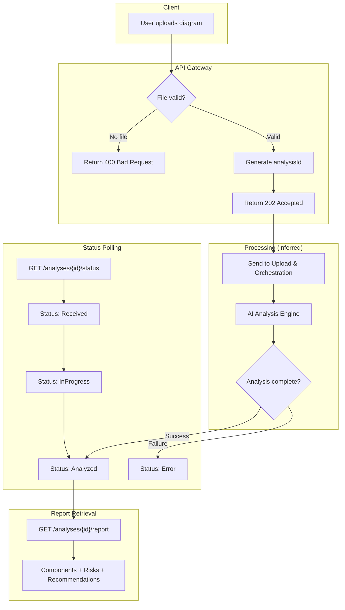
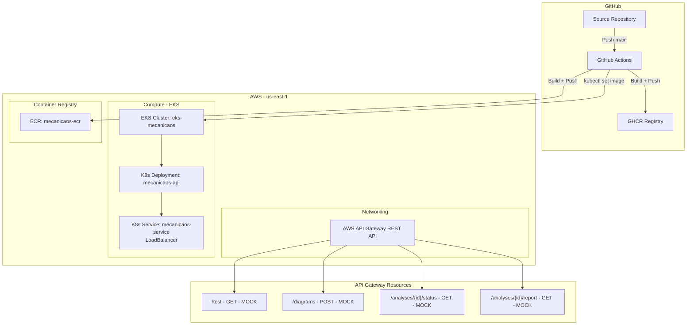
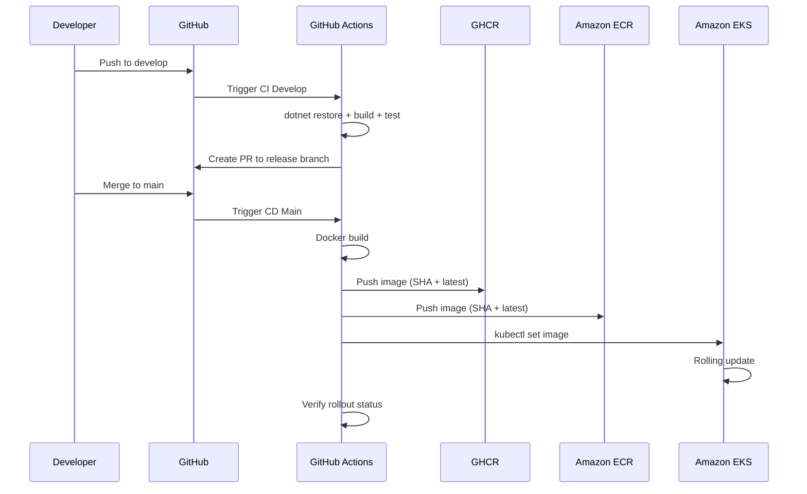
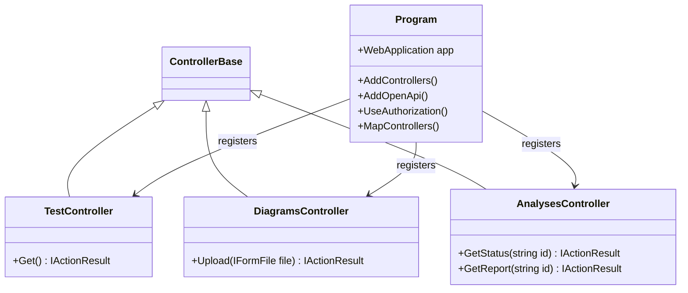

# Fiap Arch Analyzer — API Gateway

Exposes endpoints for uploading software architecture diagrams and retrieving AI-generated analysis reports.

## Tech Stack

- **Runtime:** .NET 9.0 / ASP.NET Core
- **Infrastructure:** AWS API Gateway, Amazon EKS, Amazon ECR, Terraform
- **CI/CD:** GitHub Actions, GHCR
- **Branching:** GitFlow with semantic versioning

---

## Architecture

### System Overview — Service Communication



### Business Flow — Diagram Analysis Pipeline



### Infrastructure Topology — AWS Deployment



### CI/CD Pipeline



### Internal Structure



---

## API Endpoints

| Method | Path | Description |
|--------|------|-------------|
| GET | `/test` | Health check |
| POST | `/diagrams` | Upload architecture diagram (multipart/form-data) |
| GET | `/analyses/{id}/status` | Poll analysis status |
| GET | `/analyses/{id}/report` | Retrieve AI-generated report |

---

## Key Observations

- **Current state:** Terraform integrations use `MOCK` type — downstream services not yet wired. Controllers return hardcoded responses.
- **SPOF:** Single API Gateway without visible HA/HPA config in this repo.
- **No auth configured:** `authorization = "NONE"` on all Terraform methods; `UseAuthorization()` present but no auth scheme registered.
- **Inferred dependencies:** Upload & Orchestration service + AI Analysis service referenced but not connected yet.

---

## Running Locally

```bash
cd src/Fiap.ArchAnalyzer.ApiGateway
dotnet run
```

## Deploy

Push to `main` triggers full CD pipeline → Docker build → ECR/GHCR push → EKS rolling update.
